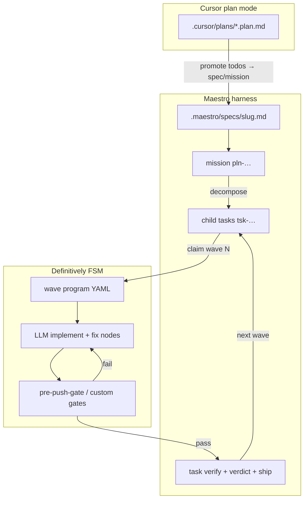

# Maestro × Definitively Integration

How to combine **Maestro** (multi-session task harness) with **Definitively** (YAML FSM execution) so a Cursor planning-mode plan becomes an implemented, verified mission.

## Layering (do not nest both ways)

```
Agent session
  └─ Maestro          spec, mission, task claim/verify/ship, evidence, handoffs
       └─ Definitively   synchronous FSM: gates, LLM fix loops, git/gh nodes
            └─ subprocesses   moon, mix, agent CLI (via profile), git, gh
```

| Concern | Owner |
|---------|-------|
| What to build, acceptance criteria, PR boundaries | Maestro (spec, mission, contract) |
| How to run gates and retry with LLM until green | Definitively (YAML program) |
| Cross-session resume, block/ship verdicts | Maestro |
| Single-run orchestration graph | Definitively |

Maestro owns **lifecycle**; Definitively owns **execution graphs** within one wave.

## Agent profiles and program inputs (v0.4.0)

LLM nodes no longer inline vendor argv. Each node declares `agent: cursor` (or another profile id); definitively loads `.definitively/agents/<id>.yml` to build `{executable, argv}`, deliver the prompt, and parse stdout. Set a workspace default with `DEFINITIVELY_AGENT=cursor` (devenv does this automatically). Override the binary path via profile `executable_env` — e.g. `DEFINITIVELY_AGENT_CURSOR_EXECUTABLE` on NixOS.

Programs declare run parameters under `program.inputs`. Pass values as CLI flags before the FSM starts:

```bash
definitively run "$PWD/.definitively/programs/plan-mission.yml" \
  --plan-file "$PWD/.cursor/plans/your.plan.md"
```

`DEFINITIVELY_PLAN_FILE` still works for one release but logs a deprecation warning. See book chapters [Agent profiles](https://industrial.github.io/definitively/authoring/agent-profiles.html) and [Program inputs](https://industrial.github.io/definitively/authoring/program-inputs.html).

## End-to-end flow: Cursor plan → shipped mission



### Step 1 — Cursor plan → Maestro spec/mission

Cursor plan mode emits `.cursor/plans/<name>.plan.md` with YAML frontmatter:

```yaml
todos:
  - id: domain-spec
    content: Define Domain.* structs + Spec.Loader/Validator
    status: pending
```

**Promote to maestro** (manual v1; scriptable v2):

1. Author or paste plan body into `.maestro/specs/<slug>.md` with `mode: heavy` and acceptance criteria derived from plan todos.
2. Create mission: `maestro mission new "<title>" --from-spec .maestro/specs/<slug>.md`
3. Decompose todos into child tasks:

```bash
maestro mission decompose <pln-id> --file - <<'JSON'
[
  { "title": "Domain structs + Spec.Loader", "slug": "domain-spec" },
  { "title": "Outcome rules + Evaluator", "slug": "outcome-eval" },
  { "title": "Data-driven Engine", "slug": "engine-dynamic" }
]
JSON
```

Optional: persist rationale in `.maestro/missions/<slug>.md` sidecar (copy plan overview + phasing).

### Step 2 — One Definitively program per maestro wave

Each child task gets a **wave program** under `.definitively/programs/missions/<pln-slug>/`:

```text
wave-01-domain-spec.yml
wave-02-outcome-eval.yml
…
```

**Wave program shape** (template — not yet in repo):

```yaml
program:
  id: wave_domain_spec
  initial: idle
states:
  idle:
    type: passive
    on: { start: implement }
  implement:
    type: active
    node: llm_implement
    on:
      success: gate
      failure: implement
      partial: implement
  gate:
    type: active
    node: pre_push_gate   # cli: verify-gate.sh
    on:
      success: maestro_verify
      failure: fix
      partial: fix
  fix:
    type: active
    node: llm_fix
    on:
      success: gate
      failure: fix
  maestro_verify:
    type: active
    node: maestro_task_verify   # future: maestro CLI node
    on:
      success: done
      failure: fix
  done:
    type: final
```

Reuse existing gate programs via CLI nodes pointing at `.maestro/bootstrap/validation/verify-gate.sh`.

LLM nodes carry **task-scoped prompts** referencing the maestro contract (`maestro contract show --task <id>`).

### Step 3 — Agent loop per wave

For each child task in dependency order:

1. `maestro task claim <tsk-id>`
2. `maestro plan check --task <id> --plan-file .cursor/plans/<plan>.plan.md` (or wave-specific plan slice)
3. `definitively run "$PWD/.definitively/programs/plan-mission.yml" --plan-file "$PWD/.cursor/plans/<plan>.plan.md"` (or a wave-specific program when present)
4. On `done` final state:
   - `maestro evidence record --task <id> --command ".maestro/bootstrap/validation/verify-gate.sh" --exit 0`
   - `maestro task verify <id>`
   - `maestro verdict request --task <id>`
   - `maestro task ship <id>`
5. Claim next wave.

Human approval between waves: add `approval` states in the wave YAML or pause after ship and wait for user.

### Step 4 — Mission completion

When all child tasks are `shipped`, mission is complete. Optional final program:

- `git tag` / `gh pr create` via existing git/gh nodes (`git-gh-ship.yml` template)

## What exists today vs planned

| Capability | Status |
|------------|--------|
| pre-commit / pre-push gate programs | ✓ `.definitively/programs/` |
| dev-quality-loop (gates + LLM fix) | ✓ |
| Maestro verify scripts | ✓ `.maestro/bootstrap/validation/verify-*.sh` |
| git / gh node kinds | ✓ v0.3.0 |
| Agent profiles (`.definitively/agents/`) | ✓ v0.4.0 |
| Program CLI inputs (`--plan-file`, etc.) | ✓ v0.4.0 |
| `plan-mission.yml` end-to-end program | ✓ |
| `maestro` node kind (init, spec, mission, claim, verify, ship) | ✓ v0.4.0 |
| Wave program template per mission | superseded by `plan-mission.yml` |
| `.plan.md` → task batch JSON converter | planned |
| Mission-level meta-FSM (orchestrates all waves) | future |

## Recommended next implementation slices

1. **Wave template** — `priv/templates/definitively/programs/task-wave.yml` with placeholders for LLM prompt + gate path.
2. **`maestro` node kind** — structured actions: `claim`, `verify`, `evidence_record`, `ship` (mirrors git/gh pattern).
3. **Plan ingest script** — `scripts/plan-to-mission.sh`: reads `.cursor/plans/*.plan.md` frontmatter todos → JSON for `mission decompose`.
4. **Scaffold command** — `definitively scaffold mission <pln-id>` writes wave YAMLs from mission child task list.

## Anti-patterns

- **Definitively driving maestro mission state** — FSM should not replace task.jsonl; it executes one wave.
- **Maestro calling moon ad-hoc** — use gate programs so fix loops and evidence commands stay stable.
- **dev-quality-loop in git hooks** — hooks use cli-only gates; LLM loops are manual or wave-scoped.

## References

- `.maestro/MAESTRO.md` — pre-ship ritual with verify-gate.sh
- `.maestro/docs/VALIDATION_LADDER.md` — rung → program mapping
- `.definitively/README.md` — existing programs
- Book: [Hook integration](https://industrial.github.io/definitively/patterns/hook-integration.html), [Dev quality loop](https://industrial.github.io/definitively/patterns/dev-quality-loop.html)
