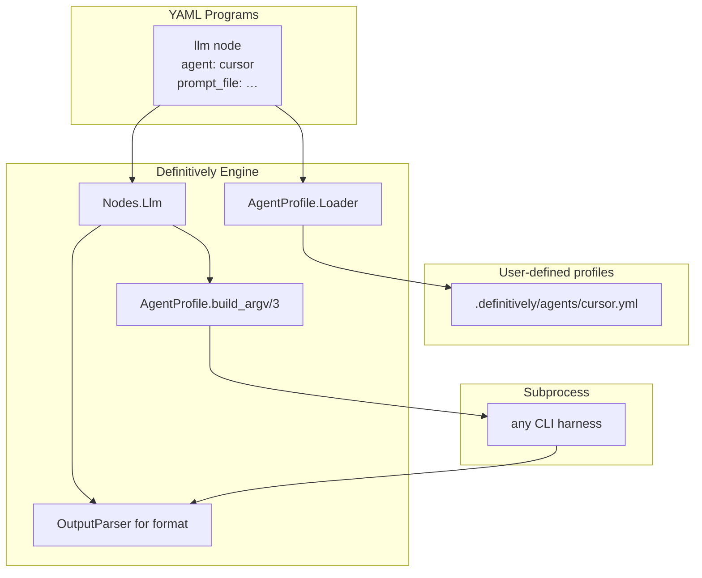

# Agent Profile Refactor (Harness-Agnostic LLM Nodes)

Decouple definitively LLM nodes from Cursor via YAML agent profiles, and add first-class CLI program inputs (e.g. `--plan-file`) so run parameters are passed as flags—not env vars. Programs declare inputs in YAML; the executor resolves argv, prompt delivery, and output parsing from profile config.

## Problem

Cursor is hard-coded at four layers today:

| Layer | Coupling |
|-------|----------|
| Programs | `dev-quality-loop.yml`, `plan-mission.yml` — 12-line `cursor-agent` argv anchor |
| Executor | `Nodes.Llm` — `resolve_executable("cursor-agent")`, `DEFINITIVELY_CURSOR_AGENT`, Nix default path |
| Output parsing | `Nodes.Llm` — `decode_llm_line` knows Cursor stream-json `{type: result, result: …}` |
| Run inputs | `plan-mission.yml` requires `DEFINITIVELY_PLAN_FILE` env — no CLI flags |

Maestro/git/gh nodes already show the right pattern: **structured domain module + YAML config**, not vendor argv inlined in every program.

## Target architecture



**Principle:** Definitively ships the **profile schema and parser primitives** only.

## Program inputs (CLI flags, not env vars)

Programs declare named inputs under `program.inputs`. Flag names derive from input keys (`plan_file` → `--plan-file`). `RunContext` gains `inputs: map()` populated at run start. Unknown CLI flags error with a hint; missing required inputs fail before the FSM starts.

Example invocation:

```bash
definitively run .definitively/programs/plan-mission.yml \
  --plan-file .cursor/plans/agent_profile_refactor_054927eb.plan.md
```

## Agent profile schema (v1)

New file per profile: `.definitively/agents/<id>.yml`

- **Selection:** per-node `agent: cursor`, default `DEFINITIVELY_AGENT=cursor`, or raw `command:` (mutually exclusive with `agent`)
- **Executable resolution:** `executable_env` → `executable` → error (no magic `cursor-agent` rewrite)
- **Prompt modes:** `argv_after_delimiter`, `flag`, `stdin`
- **Output formats:** `stream_json`, `json`, `text` with configurable extraction and envelope paths

## Rollout order

1. Program inputs — schema, CLI parser, RunContext, plan-mission `--plan-file`
2. AgentProfile domain + loader + validator
3. Llm executor refactor + tests with stub profile
4. Migrate repo programs + add `.definitively/agents/cursor.yml`
5. Remove cursor hardcoding + deprecated plan env vars
6. Docs + book chapters (inputs + agent profiles) + version bump to 0.4.0
