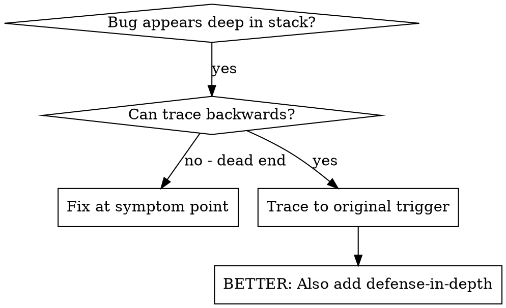
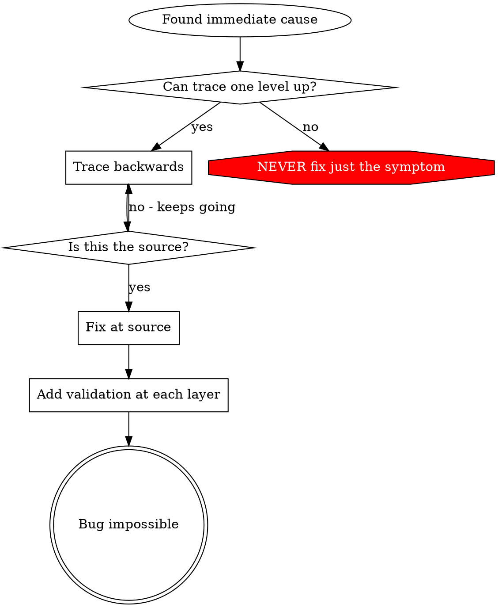

# Root Cause Tracing

Use when errors occur deep in execution and you need to trace back to find the original trigger - systematically traces bugs backward through call stack, adding instrumentation when needed, to identify source of invalid data or incorrect behavior

## Overview

Bugs often manifest deep in the call stack (git init in wrong directory, file created in wrong location, database opened with wrong path). Your instinct is to fix where the error appears, but that's treating a symptom.

**Core principle:** Trace backward through the call chain until you find the original trigger, then fix at the source.

## When to Use

### ✅ Good: ```dot




## The Tracing Process

### ✅ Good: 1. Observe the Symptom

```
Error: git init failed in /Users/jesse/project/packages/core
```

### ✅ Good: 2. Find Immediate Cause

```typescript
await execFileAsync('git', ['init'], { cwd: projectDir });
```

### ✅ Good: 3. Ask: What Called This?

```typescript
WorktreeManager.createSessionWorktree(projectDir, sessionId)
  → called by Session.initializeWorkspace()
  → called by Session.create()
  → called by test at Project.create()
```

### ✅ Good: 5. Find Original Trigger

```typescript
const context = setupCoreTest(); // Returns { tempDir: '' }
Project.create('name', context.tempDir); // Accessed before beforeEach!
```


## Adding Stack Traces

### ✅ Good: When you can't trace manually, add instrumentation:

```typescript
// Before the problematic operation
async function gitInit(directory: string) {
  const stack = new Error().stack;
  console.error('DEBUG git init:', {
    directory,
    cwd: process.cwd(),
    nodeEnv: process.env.NODE_ENV,
    stack,
  });

  await execFileAsync('git', ['init'], { cwd: directory });
}
```


## Finding Which Test Causes Pollution

### ✅ Good: If something appears during tests but you don't know which test:

```bash
./find-polluter.sh '.git' 'src/**/*.test.ts'
```


## Real Example: Empty projectDir


## Key Principle

### ✅ Good: ```dot




## Stack Trace Tips

**In tests:** Use `console.error()` not logger - logger may be suppressed
**Before operation:** Log before the dangerous operation, not after it fails
**Include context:** Directory, cwd, environment variables, timestamps
**Capture stack:** `new Error().stack` shows complete call chain

## Real-World Impact

- Found root cause through 5-level trace
- Fixed at source (getter validation)
- Added 4 layers of defense
- 1847 tests passed, zero pollution