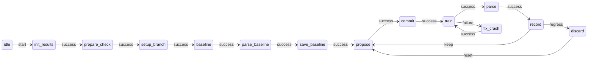

# Case study: autoresearch loop

Karpathy's [autoresearch](https://github.com/karpathy/autoresearch) separates **strategy** (human markdown), **execution** (agent loop), and **judgment** (immutable eval harness). Definitively Tier B formalizes the execution layer as an FSM while the LLM still proposes experiments.

## Overview



## Three-layer contract

| Layer | Autoresearch | Definitively |
|-------|--------------|--------------|
| Strategy | `program.md` | `.definitively/prompts/autoresearch-propose.md` |
| Execution | Agent loop | `autoresearch.yml` FSM |
| Judgment | `prepare.py` + `evaluate_bpb` | `eval.exs` + `bin/record-experiment.sh` |

## Running

```bash
export AUTORESEARCH_RUN_TAG=jun5
./.definitively/autoresearch/bin/run-autoresearch.sh "$AUTORESEARCH_RUN_TAG"
```

## Dogfood sandbox

This repo ships a non-GPU sandbox under `.definitively/autoresearch/` so you can test the FSM before pointing it at a real ML harness. The agent edits only `candidate.exs`.

Templates copy on `definitively init` from `priv/templates/definitively/autoresearch/`.

**Try it:** `definitively visualize .definitively/programs/autoresearch.yml`
