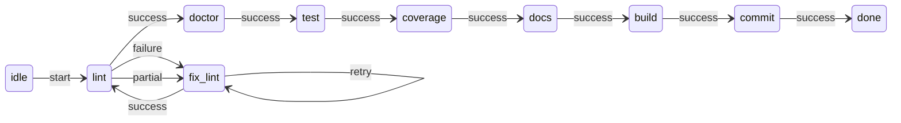

# Case study: dev quality loop

This repository dogfoods definitively via `.definitively/programs/dev-quality-loop.yml` — a workflow that runs moon quality gates and LLM fix loops until the build passes or the run fails.

## Overview



Each `fix_*` state runs an LLM node with a dedicated prompt file, then loops back to retry the gate.

## CLI gate nodes

Each gate is a moon task:

```yaml
moon_lint:
  kind: cli
  command: ["moon", "run", "definitively:lint"]
  timeout_ms: 300000
  outcome:
    success:
      - exit_code: 0
    failure:
      - exit_code: {neq: 0}
    partial:
      - exit_code: 0
```

## LLM fix nodes

Fix nodes share a YAML anchor for the agent profile and outcome rules:

```yaml
agent: &cursor_agent cursor
outcome: &llm_outcome
  success:
    - jq: '.status == "ok"'
    - signal: fix_complete
  failure:
    - timeout: true
    - signal: refused
```

The `cursor` profile (`.definitively/agents/cursor.yml`) supplies argv and stream-json parsing — no inlined `cursor-agent` command in the program.

## Running it

From the definitively repo root (with moon and cursor-agent on PATH, or `DEFINITIVELY_AGENT_CURSOR_EXECUTABLE` set):

```bash
export DEFINITIVELY_AGENT=cursor   # devenv sets this automatically
definitively run "$PWD/.definitively/programs/dev-quality-loop.yml"
```

**Try it:** Visualize the full graph — `definitively visualize .definitively/programs/dev-quality-loop.yml`.
