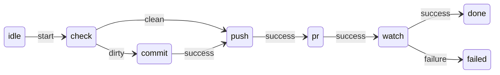

# Git and GitHub automation

This pattern chains native **git** and **gh** nodes to inspect the repo, commit and push changes, open a PR, and wait for CI — without language-specific tool wrappers.

## Overview



## Example program

After `definitively init`, find the full workflow at `.definitively/programs/git-gh-ship.yml`:

```bash
definitively run "$PWD/.definitively/programs/git-gh-ship.yml"
```

## Key nodes

### Check working tree

```yaml
repo_status:
  kind: git
  action: status
  outcome:
    success:
      - signal: clean
    partial:
      - signal: dirty
```

Route `partial` to commit when there are uncommitted changes; `success` skips straight to push.

### Commit and push

```yaml
ship_commit:
  kind: git
  action: commit
  options:
    message: "chore: ship via definitively"
    add: all

push_origin:
  kind: git
  action: push
  options:
    remote: origin
    set_upstream: true
```

### Open PR and watch CI

```yaml
open_pr:
  kind: gh
  action: pr_create
  options:
    title: "chore: ship via definitively"

watch_ci:
  kind: gh
  action: run_watch
  options:
    workflow: definitively-ci.yml
  timeout_ms: 900000
```

Adjust `workflow` to match your repository's CI workflow filename.

## Node catalog

Reusable fragments live in:

- `.definitively/nodes/git.yml`
- `.definitively/nodes/gh.yml`

Copy nodes into your own programs; each file is a set of documented YAML fragments.

## When to use this vs dev quality loop

| Pattern | Best for |
|---------|----------|
| [Dev quality loop](./dev-quality-loop.md) | Lint/test/fix loops with LLM repair |
| Git + GitHub automation | Ship commits, PRs, and CI gates |

They compose: run quality gates first, then a git-gh-ship program to publish.

**Try it:** Visualize the workflow — `definitively visualize .definitively/programs/git-gh-ship.yml`.
